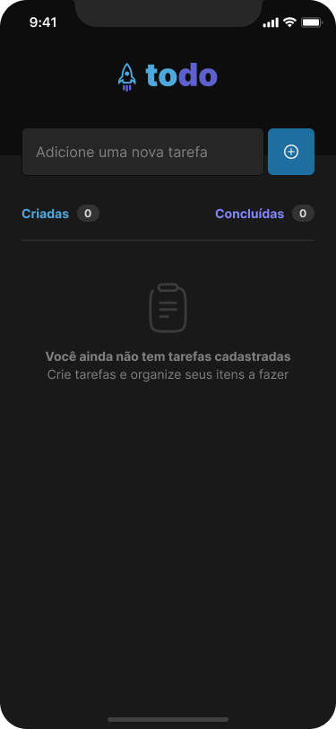
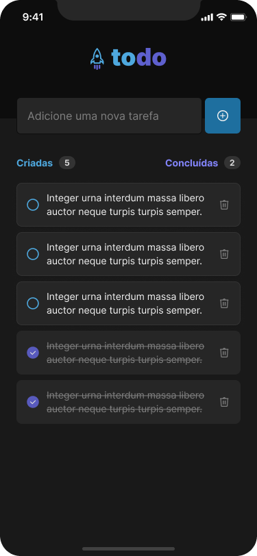

<h1>appTodo-Mobile</h1> 

ToDo List é uma aplicação mobile de criação de controle de tarefas.

Esse projeto é um dos desafios da trilha de React Native Ignite, com o bootcamp completo de especialização em React,React Native e Node.js

<h3>Link do Figma do desafio </h3>
<a>https://www.figma.com/file/FDWj544PEaEA37uFur4kw1/ToDo-List-%E2%80%A2-Desafio-React-Native-(Copy)?type=design&node-id=101%3A96&mode=design&t=FscBsgle7ktks3so-1</a>

<h3>Imagens de ideia do app</h3>

